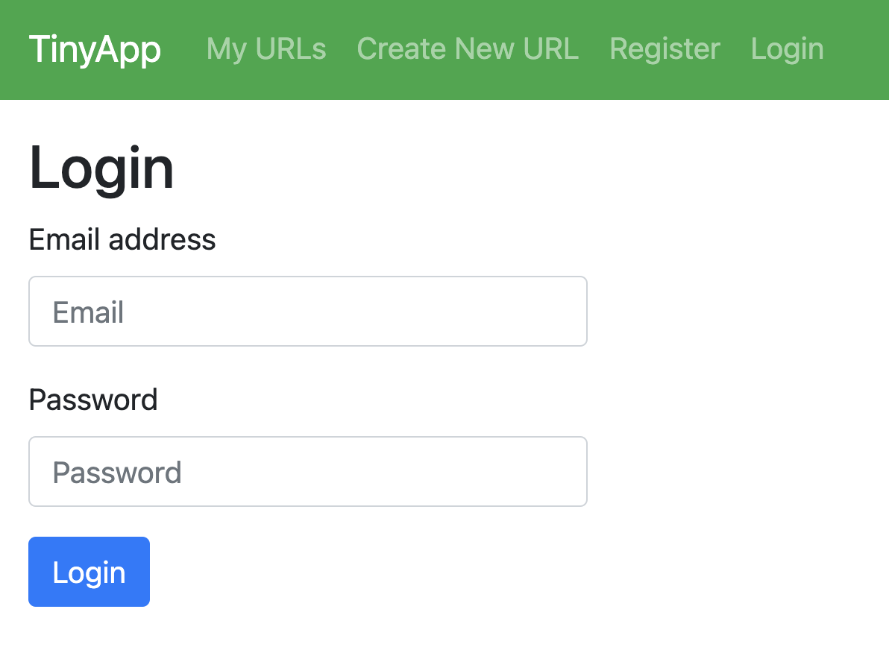
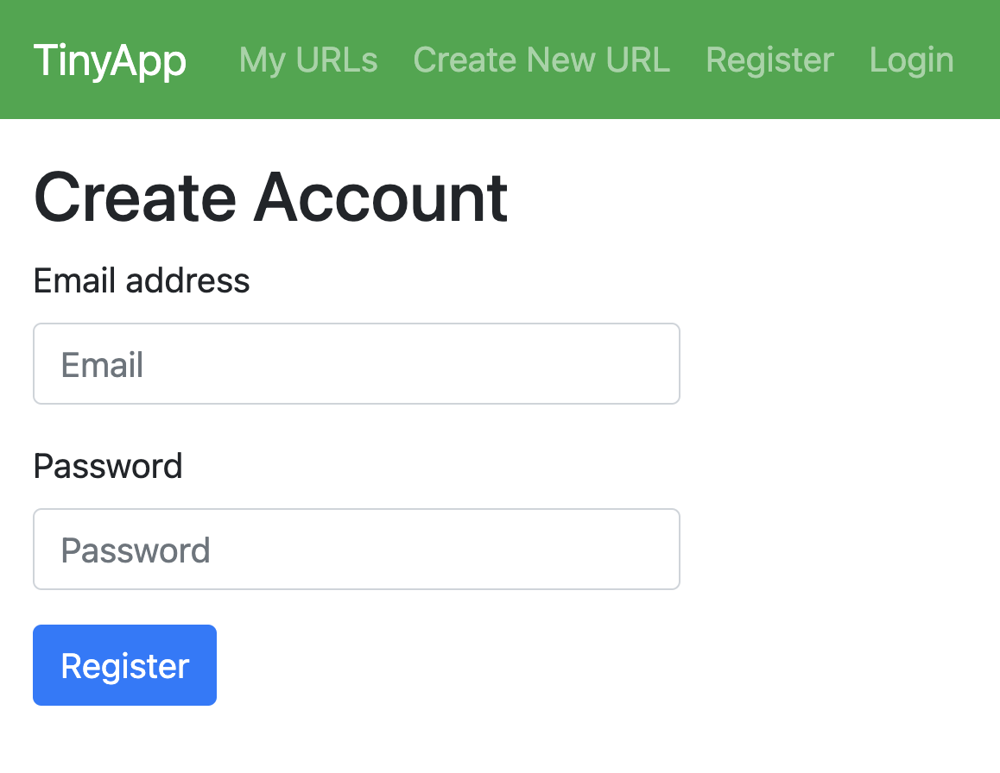
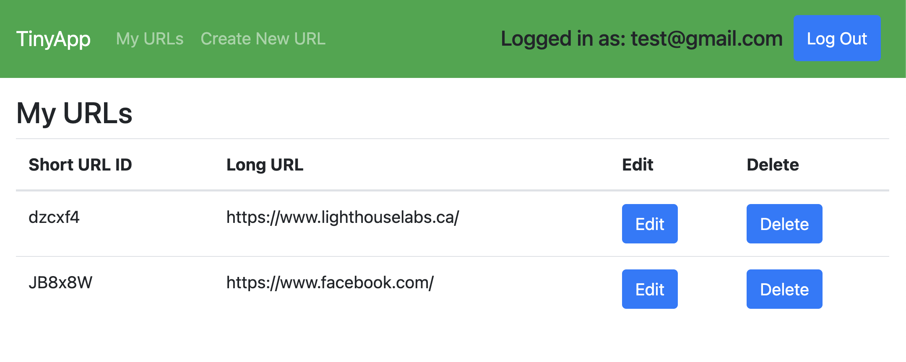
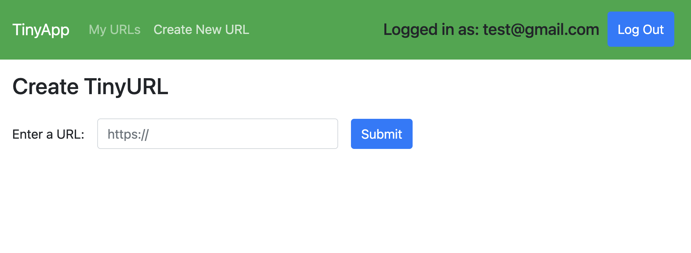
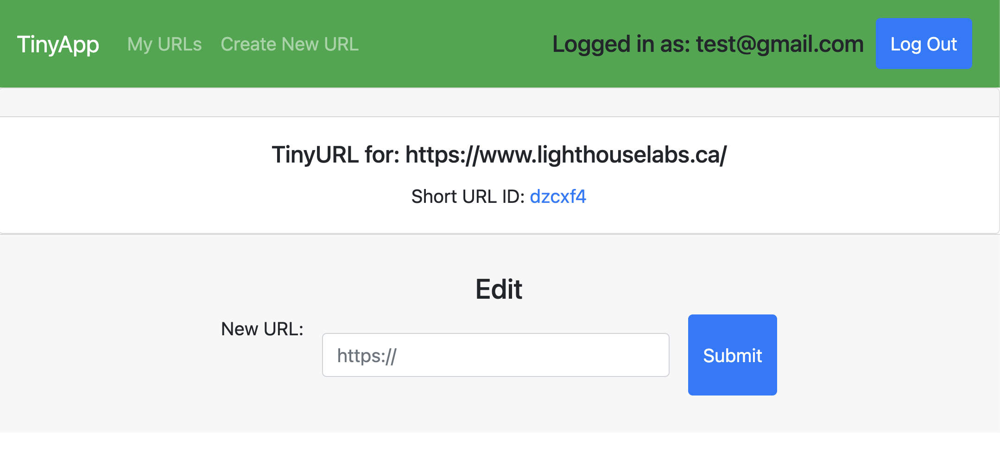

# TinyApp Project

TinyApp is a URL shortening service similar to TinyURL, Bitly, or Goo.gl. This app will take a regular URL and transform it into an encoded version, which redirects back to the original URL.

This project utilizes specific technologies such as:
- Web Server: Node.js
- Middleware: Express
- Template Engine: EJS

This project uses the following dependencies:
- bcrypt
- body-parser
- cookie-session
- Node.js
- Express
- EJS
- morgan


# Final Product
Here is what the final web application looks like:












Getting Started:

- Install all dependencies using the ```npm install`` command.
- Run the web server using the ```npm start``` command.
- To register, go to: ```http://localhost:8080/register```.
- To log in, go to: ```http://localhost:8080/login```.
- Use the nagivation bar to:
  - Create new shorten URLs
  - Access list of URLs (must be logged in first)
- Utilize Edit and Delete buttons to update your URLs in My URLs